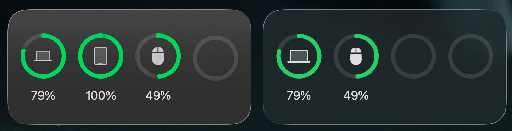

# 京东京造 JZM5 电量

让 macOS 电池小组件和 [AirBattery](https://github.com/lihaoyun6/AirBattery) 显示京东京造 JZM5 的 2.4G 模式电量。

程序直接读取接收器的私有 HID 电量报告，每分钟更新一次电量和充电状态，并在菜单栏提供权限状态、开机启动和退出选项。它不会修改 AirBattery，也不会写入 AirBattery 的容器目录。



## 下载与启动

1. 从 Releases 下载 `JZM5BatteryTray.app.zip`，解压后把应用拖到“应用程序”。
2. 本项目没有 Apple Developer ID 签名和公证。若 macOS 提示应用已损坏或无法验证开发者，只移除本应用的下载隔离属性：

   ```bash
   sudo xattr -dr com.apple.quarantine /Applications/JZM5BatteryTray.app
   ```

3. 启动应用，点击菜单栏鼠标图标里的“输入监控授权…”，再到“系统设置 → 隐私与安全性 → 输入监控”允许“京东京造 JZM5 电量”。授权后重新启动应用。

不要使用 `spctl --master-disable` 全局关闭 Gatekeeper。

## AirBattery Nearcast

AirBattery 不是必需的；macOS 电池小组件可由本程序独立更新。需要同步到 AirBattery 时：

1. 在 AirBattery 设置中开启 Nearcast。
2. 在终端运行一次下面的命令，把 AirBattery 的 Nearcast 群组 ID 写入本程序自己的偏好设置：

   ```bash
   defaults write local.jzm5.batterytray nearcastGroupID \
     "$(defaults read com.lihaoyun6.AirBattery ncGroupID)"
   ```

3. 重新启动 `JZM5BatteryTray.app`，并在 macOS 询问时允许其访问本地网络。

群组 ID 不会写入应用包或上传到网络。AirBattery 重置群组 ID、重新安装或换 Mac 后，需要重新执行上述命令。

## 注意事项

- 仅适配京东京造 JZM5 的 2.4G 接收器 `VID 0x362D / PID 0xD107`，不适用于蓝牙模式或其他型号。
- 鼠标必须已与接收器配对；网页驱动运行时可能占用 HID 接口，测试前请关闭相关页面。
- 应用需要“输入监控”权限读取 HID 报告；Nearcast 还需要“本地网络”权限。
- 应用启动时立即查询一次，之后每 60 秒查询。读取失败时保留上一次有效电量，不会发布假 `0%`。
- 应用退出后，macOS 电源项会消失；AirBattery 会收到离线状态，但其界面或小组件可能要等下一次时间线刷新才消失。
- 系统电池小组件的刷新由 macOS 调度，显示可能比真实电量晚一个刷新周期。
- 系统电源项使用 macOS 的非公开 IOKit 接口，未来系统版本可能改变行为。
- Release 为 Apple Silicon（arm64）版本。Intel Mac 可从源码自行构建。

## 从源码构建

需要 macOS 13 或更高版本及 Xcode Command Line Tools：

```bash
./build.sh
open dist/JZM5BatteryTray.app
```

构建脚本默认使用 ad-hoc 签名，不需要开发者证书。产物位于 `dist/JZM5BatteryTray.app`。如果本机有开发证书，建议用稳定身份构建，避免每次重新编译后都要重新授予输入监控权限：

```bash
CODE_SIGN_IDENTITY="Apple Development: 你的证书名称" ./build.sh
```

## 适配其他鼠标

当前模板适合“发送 HID Output Report，然后等待异步 Input Report”的 2.4G 接收器。设备私有信息全部集中在 [JZM5BatteryTray.swift](JZM5BatteryTray.swift) 顶部的 `DeviceAdapter`：

| 字段或函数 | 需要填写的内容 |
| --- | --- |
| `displayName` | 系统组件和 AirBattery 中显示的名称 |
| `accessoryIdentifier` | 本程序内部使用的稳定设备 ID |
| `receiverVendorID` / `receiverProductID` | USB 接收器的 VID/PID |
| `accessoryProductID` | 配对鼠标的 PID，仅用于发布系统电源项 |
| `usagePage` / `usage` | macOS 上承载私有协议的逻辑 HID 接口 |
| `outputReportID` / `inputReportID` | 查询和响应的 Report ID |
| `makeQueryReport()` | 构造完整查询报告 |
| `parse(reportID:bytes:)` | 验证回包并返回电量、充电状态 |

对新设备完成逆向后，一般只需修改这个区块和 `Info.plist` 中的应用名称。公共的 HID 枚举、定时查询、系统电源项、菜单栏与 Nearcast 不需要改。

### 从网页驱动快速抓 HID 报文

HAR 不会记录 WebHID 的 USB 收发内容，只会保存网页、接口请求和 JavaScript 文件。HAR 适合搜索协议实现；要拿到真实报文，最快的方法是在 Chrome/Edge 的网页驱动页面打开开发者工具，在 Console 运行下面的拦截代码，然后点击网页里的“连接”或“刷新设备”：

```javascript
const toBytes = data => data instanceof ArrayBuffer
  ? new Uint8Array(data)
  : new Uint8Array(data.buffer, data.byteOffset, data.byteLength);

const hex = data => [...toBytes(data)]
  .map(value => value.toString(16).padStart(2, "0"))
  .join(" ");

const originalSendReport = HIDDevice.prototype.sendReport;
HIDDevice.prototype.sendReport = function (reportId, data) {
  console.log("HID OUT", this.productName, `reportId=0x${reportId.toString(16)}`, hex(data));
  return originalSendReport.call(this, reportId, data);
};

const originalSendFeature = HIDDevice.prototype.sendFeatureReport;
HIDDevice.prototype.sendFeatureReport = function (reportId, data) {
  console.log("HID FEATURE OUT", this.productName, `reportId=0x${reportId.toString(16)}`, hex(data));
  return originalSendFeature.call(this, reportId, data);
};

const originalReceiveFeature = HIDDevice.prototype.receiveFeatureReport;
HIDDevice.prototype.receiveFeatureReport = async function (reportId) {
  const data = await originalReceiveFeature.call(this, reportId);
  console.log("HID FEATURE IN", this.productName, `reportId=0x${reportId.toString(16)}`, hex(data));
  return data;
};

for (const device of await navigator.hid.getDevices()) {
  console.log("HID DEVICE", {
    productName: device.productName,
    vendorId: `0x${device.vendorId.toString(16)}`,
    productId: `0x${device.productId.toString(16)}`,
    collections: device.collections
  });

  device.addEventListener("inputreport", event => {
    console.log(
      "HID IN",
      device.productName,
      `reportId=0x${event.reportId.toString(16)}`,
      hex(event.data)
    );
  });
}
```

先在网页中授权一次设备，再执行代码。如果网页在执行拦截代码之前已经缓存了 `sendReport` 函数，可在 DevTools 的 Sources 中搜索这些关键词并打断点：

```text
navigator.hid
requestDevice
sendReport
sendFeatureReport
receiveFeatureReport
inputreport
battery
charge
power
isCharging
```

每次操作至少记录以下内容：

- 接收器的 VID/PID、产品名。
- `device.collections` 中的 Usage Page、Usage。
- Output/Feature Report ID、Payload 长度和完整查询字节。
- Input Report ID、Payload 长度和完整响应字节。
- 网页解析电量和充电状态的代码。

WebHID 的 `event.reportId` 是单独参数，`event.data` 通常不包含 Report ID；IOKit 某些设备会把 Report ID 同时放在缓冲区第 0 字节。当前解析函数兼容这两种输入布局。

### 快速找到电量字节和充电位

不要只抓一份回包。保持电量基本不变，分别采集“未插线”和“正在充电”的响应；再采集两个不同电量百分比的响应。把已经去掉 Report ID 的十六进制 Payload 粘贴到下面的脚本：

```python
before = bytes.fromhex("06 00 ...")
after  = bytes.fromhex("06 00 ...")

if len(before) != len(after):
    raise SystemExit(f"长度不同：{len(before)} != {len(after)}")

for offset, (old, new) in enumerate(zip(before, after)):
    if old != new:
        print(
            f"byte[{offset}] 0x{old:02X} -> 0x{new:02X} "
            f"xor=0x{old ^ new:02X}"
        )
```

判断方法：

- 插线前后只有某一位稳定翻转，这一位通常是充电状态。比如 XOR 为 `0x80`，说明最高位可能是充电位。
- 随电量变化而变化、数值接近 `0–100` 的低位通常是电量。
- 每次查询都变化的字段可能是序号、时间或校验值，不要直接当成电量。
- 最后一个变化字节经常是校验和。先在网页脚本里搜索求和、XOR、CRC 等计算。
- 至少重复三轮插线/拔线，避免把配置档位、回报率变化误认为充电状态。

JZM5 的结果是：

```text
payload[19] & 0x7F       = 电量百分比
(payload[19] & 0x80) != 0 = 正在充电
```

也就是同一个字节的低 7 位保存电量，最高位保存充电状态。

### 确认 macOS 的 HID 接口

网页看到的 Collection 不一定等于 macOS 枚举出的主 Usage。JZM5 网页使用 `0xFFC1 / 0x01`，macOS 上对应的逻辑设备却显示为 `0x008C / 0x01`。先用十进制 VID/PID 查看候选接口：

```bash
hidutil list --matching '{"VendorID":13869,"ProductID":53511}'
```

十六进制转十进制可用：

```bash
printf '%d\n' 0x362D
printf '%d\n' 0xD107
```

把枚举出的 `PrimaryUsagePage` 和 `PrimaryUsage` 写入 `DeviceAdapter.usagePage`、`DeviceAdapter.usage`。如果存在多个接口，优先测试厂商自定义 Usage Page，不要向普通鼠标移动或键盘输入接口发送私有命令。

### 填入适配区并验证

1. 把 VID/PID、Usage、Report ID 填入 `DeviceAdapter`。
2. 在 `makeQueryReport()` 中复刻网页发送的完整报告。注意 IOKit 对部分设备要求缓冲区第 0 字节包含 Report ID。
3. 在 `parse(reportID:bytes:)` 中先验证响应类型和命令字，再解析电量及充电位。
4. 关闭网页驱动，避免浏览器同时占用接口。
5. 执行 `./build.sh`，运行 `dist/JZM5BatteryTray.app`。
6. 分别测试未充电、充电中和电量变化，确认系统组件与 AirBattery 一致。

如果新设备使用 Feature Report、加密会话、动态校验或主动广播而不是“Output + Interrupt-IN”，还需要对应调整 `readBattery()`；这些行为无法只靠更换字节偏移完成。

## 工作原理

程序在接收器的 `Usage Page 0x008C / Usage 0x01` 接口发送 Output Report `0xB3 + 0x06`，从 Input Report `0xB4` 的第 19 字节解析电量和充电状态。随后将结果发布为 macOS Accessory Power Source，并可选通过 AirBattery Nearcast 在本机同步。

## Contributors

- LANMIN-X
- OpenAI Codex：协助协议分析、macOS 桥接实现与文档整理
